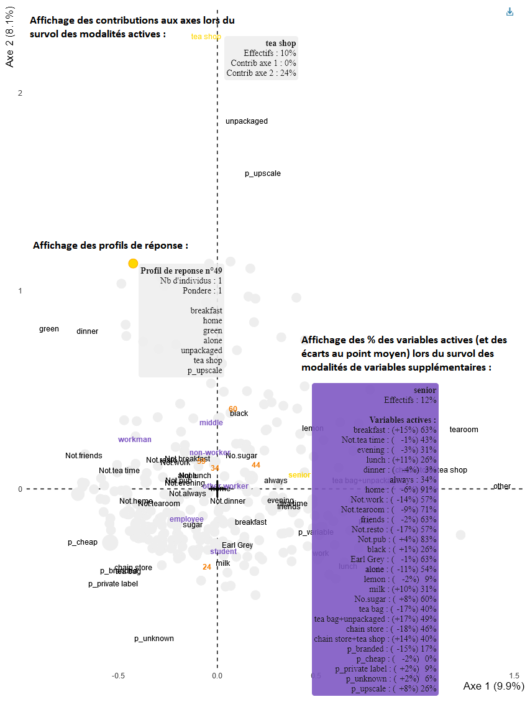

<!-- README.md is generated from README.Rmd. Please edit that file -->

```{r, include = FALSE}
knitr::opts_chunk$set(
  collapse = TRUE,
  comment = "#>",
  fig.path = "man/figures/README-",
  out.width = "100%"
)
```

# ggfacto

<!-- badges: start -->

<!-- badges: end -->

Readable, complete and pretty graphs for correspondence analysis made with [FactoMineR](http://factominer.free.fr/). Many can be rendered as interactive html plots, showing useful informations at mouse hover. The interest is not mainly visual but statistical : it helps the reader to keep in mind the data contained in the crosstab or Burt table while reading correspondance analysis, thus preventing overinterpretation. Graphs are made with [ggplot2](https://ggplot2.tidyverse.org/), which means that you can use the `+` syntax to manually add as many graphical pieces you want, or change theme elements.

## Installation

You can install ggfacto from github with:

``` r
# install.packages("devtools")
devtools::install_github("BriceNocenti/ggfacto")
```

## Usage

Interactive graph from multiple correspondence analysis (MCA):

``` r
library(ggfacto)

data(tea, package = "FactoMineR")
res.mca <- FactoMineR::MCA(tea, quanti.sup = 19, quali.sup = c(20:36), graph = FALSE)

res.mca %>% 
  ggmca(sup_vars = c("SPC", "age_Q")) %>%
  ggout()
```

```{r, include = FALSE}

library(ggfacto)

data(tea, package = "FactoMineR")
res.mca <- FactoMineR::MCA(tea, quanti.sup = 19, quali.sup = c(20:36), graph = FALSE)

res.mca %>% 
  ggmca(sup_vars = c("SPC", "age_Q")) %>%
  ggout() %>% 
  widgetframe::saveWidgetframe("readme_plot.html", selfcontained = TRUE)
```

Click on the image to open the html interactive graph: 
[](https://htmlpreview.github.io/?https://github.com/BriceNocenti/ggfacto/blob/main/readme_plot.html)
