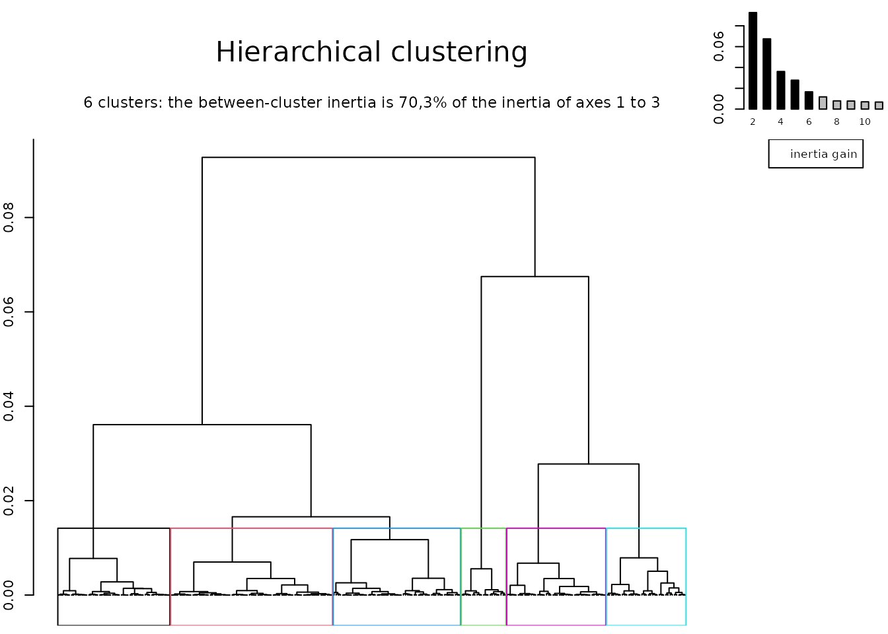
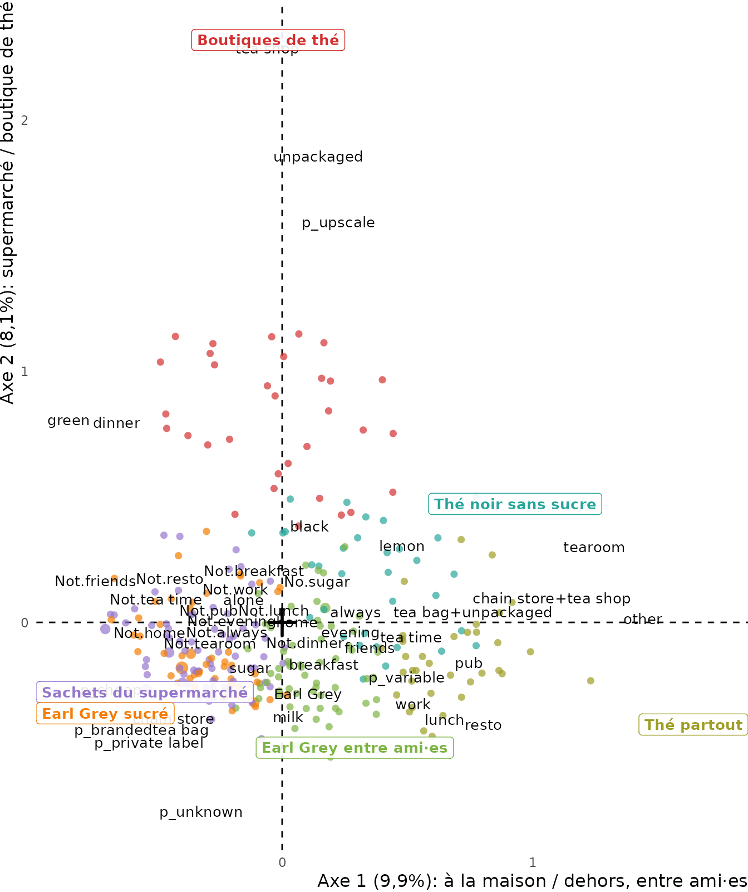

# Introduction à ggfacto : ACP, AC et ACM au plus près des données

*An English version of this guide is available: [Introduction to
ggfacto](https://bricenocenti.github.io/ggfacto/articles/ggfacto.html).*

`ggfacto` dessine les analyses géométriques de données de `FactoMineR`
pour qu’on les lise **sans quitter les données** : au survol d’un point,
le graphique interactif affiche les tableaux croisés dont il est issu,
les pourcentages colorés selon leur écart à la moyenne (bleu pour une
sur-représentation, rouge pour une sous-représentation). Une modalité au
bord du nuage se voit donc aussitôt comme une somme d’écarts, et l’on
évite de sur-interpréter la géométrie.

Les trois analyses s’écrivent de la même façon :

1.  l’analyse, avec la base de données en premier argument, comme dans
    [`tabxplor::tab()`](https://bricenocenti.github.io/tabxplor/reference/tab.html)
    ;
2.  [`interpret()`](https://bricenocenti.github.io/ggfacto/reference/interpret.md),
    le tableau des axes, avec sous lui celui des valeurs propres ;
3.  [`ggfacto()`](https://bricenocenti.github.io/ggfacto/reference/ggfacto.md),
    le graphique, que `interactive = TRUE` rend interactif ;
4.  les classes, écrites dans la base avec `mutate()`, décrites par
    [`clust_tab()`](https://bricenocenti.github.io/ggfacto/reference/clust_tab.md).

Une seule option décide de l’affichage de tous les tableaux, ceux de
`tabxplor` comme ceux de `ggfacto` : `options(tabxplor.print = "html")`
les affiche en html, dans RStudio, Positron ou un document.

## Analyse en composantes principales : des moyennes

Une ACP résume des variables numériques. Nous prenons les voitures de
`mtcars`, décrites par six mesures actives ; le nombre de cylindres
servira de variable supplémentaire.

``` r

voitures <- mtcars |> mutate(cyl = factor(cyl))

acp <- principal_component_analysis(voitures, c(mpg, disp, hp, drat, wt, qsec))
interpret(acp)
```

[TABLE]

|       | Variance   |            |        |
|-------|------------|------------|--------|
| Axe   | eigenvalue | % variance | cumul. |
|       | \<var\>    | \<col%\>   |        |
| Axe 1 | 4.187      | 69.8%      | 69.8%  |
| Axe 2 | 1.148      | 19.1%      | 88.9%  |
| Axe 3 | 0.333      | 5.6%       | 94.5%  |
| Axe 4 | 0.154      | 2.6%       | 97.1%  |
| Axe 5 | 0.125      | 2.1%       | 99.1%  |
| Axe 6 | 0.052      | 0.9%       | 100%   |
| Total | 6.000      | 100%       |        |

Le tableau s’ouvre sur ce que sont les variables **avant** l’analyse :
moyenne, écart-type et **coefficient de variation** (`sd/mean`,
l’écart-type en pourcentage de la moyenne, comparable d’une variable à
l’autre malgré leurs unités). Viennent ensuite, axe par axe, la
coordonnée de chaque variable (sa corrélation avec l’axe, colorée), sa
contribution et sa qualité de représentation (cos2). Le premier axe (70
% de la variance) oppose la cylindrée, la puissance et le poids à la
consommation (`mpg`) : c’est un facteur de taille. Le second oppose les
voitures lentes à accélérer (`qsec`) aux autres.

``` r

ggfacto(acp, voitures, sup_vars = cyl, interactive = TRUE)
```

Le graphique superpose les voitures (en gris), les variables actives
(les flèches) et les modalités supplémentaires, au barycentre de leurs
voitures. **Au survol**, une flèche donne la moyenne et le coefficient
de variation de sa variable ; une modalité supplémentaire, la moyenne de
chaque variable active dans son groupe, colorée selon son écart à
l’ensemble ; une voiture, ses valeurs. Le cercle des corrélations seul
s’obtient avec `ggfacto(acp, profiles = FALSE)`.

## Analyse des correspondances : un tableau croisé

Une AC est l’analyse d’**un tableau croisé** : on la calcule donc sur le
tableau lui-même. Nous croisons la religion et la préférence partisane
de l’enquête américaine
[`forcats::gss_cat`](https://forcats.tidyverse.org/reference/gss_cat.html),
sans les non-réponses.

``` r

gss <- forcats::gss_cat |>
  filter(!relig %in% c("No answer", "Don't know", "Not applicable"),
         !partyid %in% c("No answer", "Don't know"))

tab(gss, relig, partyid, pct = "row", color = "contrib")
```

[TABLE]

`color = "contrib"` colore les cases selon leur **contribution à la
variance du tableau** — celles qui pèsent dans l’analyse —, bleu pour
une sur-représentation et rouge pour une sous-représentation.

``` r

ac <- correspondence_analysis(tab(gss, relig, partyid))
interpret(ac)
```

[TABLE]

| Axe   | eigenvalue | % variance | cumul. |
|-------|------------|------------|--------|
|       | \<var\>    | \<col%\>   |        |
| Axe 1 | 0.049      | 76.2%      | 76.2%  |
| Axe 2 | 0.007      | 10.9%      | 87.1%  |
| Axe 3 | 0.005      | 7.5%       | 94.6%  |
| Axe 4 | 0.002      | 2.7%       | 97.3%  |
| Axe 5 | 0.001      | 2.0%       | 99.4%  |
| Axe 6 | 0          | 0.5%       | 99.9%  |
| Axe 7 | 0          | 0.1%       | 100%   |
| Total | 0.064      | 100%       |        |

Pour chaque axe,
[`interpret()`](https://bricenocenti.github.io/ggfacto/reference/interpret.md)
ne garde que les modalités qui contribuent plus que la moyenne, face à
face selon le signe de leur coordonnée. Le premier axe (76 % de la
variance) oppose les protestant·es républicain·es aux personnes sans
religion, indépendantes ou proches des démocrates ; le second, les
juif·ves et les démocrates convaincu·es aux catholiques. Une fois les
axes interprétés, on les nomme : les noms s’impriment dans les
graphiques et dans les tableaux.

``` r

ac <- name_axes(ac, "protestant·es républicain·es / sans religion",
                    "catholiques / juif·ves démocrates")
ggfacto(ac, interactive = TRUE)
```

Au survol, chaque modalité affiche son **profil** : les pourcentages en
ligne du tableau croisé, colorés selon l’écart à la moyenne. L’AC
dessine la **structure** des écarts du tableau, sans rien dire de leur
**intensité** : c’est le tableau coloré, à côté, qui la donne.

## Analyse des correspondances multiples : profils de réponses et tableau de Burt

Une ACM croise plusieurs questions à la fois. Nous prenons l’enquête
`tea` de `FactoMineR` : 300 personnes, 18 questions actives sur leurs
façons de boire le thé.

``` r

data(tea, package = "FactoMineR")

acm <- multiple_correspondence_analysis(tea, 1:18)
interpret(acm, axes = 1:2)
```

[TABLE]

[TABLE]

En ACM, les taux de variance bruts sont faibles par construction : on
choisit le nombre d’axes à interpréter sur le **taux modifié de
Benzécri**, dans le tableau des valeurs propres, ici 83 % sur les deux
premiers axes. Le premier oppose le thé pris seulement à la maison au
thé pris dehors, entre ami·es (salon de thé, restaurant, pub) ; le
second, le thé en sachet acheté au supermarché au thé en vrac de
boutique spécialisée.

``` r

acm <- name_axes(acm, "à la maison / dehors, entre ami·es",
                      "supermarché / boutique de thé")
ggfacto(acm, tea, sup_vars = c(sex, SPC), interactive = TRUE)
```

La base de données est redonnée en second argument, pour les variables
supplémentaires (en italique). Deux choses se lisent au survol :

- les **points gris** sont les **profils de réponses** : les personnes
  qui ont donné exactement les mêmes réponses, leur taille disant leur
  nombre. Chacun affiche ses réponses ;
- chaque **modalité** affiche ses tableaux croisés avec toutes les
  autres questions actives : c’est le **tableau de Burt** sur lequel
  l’ACM est calculée, ses écarts à la moyenne colorés. On revient ainsi
  aux données sans croiser les 18 questions deux à deux.

### Classification

La classification ascendante hiérarchique regroupe les individus les
plus proches sur les premiers axes. Sans `nb_clust`, elle dessine
l’arbre et coupe là où le gain de variance inter-classes chute.

``` r

hierarchical_clust(acm, ncp = 3)
```



Les classes s’écrivent dans la base avec `mutate()`, nommées dans
l’ordre voulu (`"nom" = numéro`) : l’arbre n’est pas reconstruit.

``` r

tea <- tea |>
  mutate(classes = hierarchical_clust(acm, ncp = 3, names = c(
    "Sachets du supermarché" = 1,
    "Earl Grey sucré"        = 2,
    "Earl Grey entre ami·es" = 4,
    "Thé noir sans sucre"    = 5,
    "Boutiques de thé"       = 3,
    "Thé partout"            = 6
  )))

clust_tab(acm, tea, classes)
```

[TABLE]

Le tableau décrit chaque classe par les variables actives, pondérées
comme l’analyse, les écarts à l’ensemble colorés. Le graphique place les
classes dans le nuage, leurs individus colorés :

``` r

ggfacto(acm, tea, clust = classes)
```



## Pour aller plus loin

- **Pondération** : `wt =` dans les trois analyses ; les poids passent
  jusqu’aux tableaux des bulles d’information.
- **ACM spécifique** : `excl =` écarte des modalités (par défaut, les
  valeurs manquantes) ; **sous-population** : `filter =`, ou
  [`filter()`](https://rdrr.io/r/stats/filter.html) dans le pipe, puis
  la base entière redonnée à
  [`ggfacto()`](https://bricenocenti.github.io/ggfacto/reference/ggfacto.md).
- **Graphiques** : ce sont des `ggplot`, que l’on complète avec `+`
  avant
  [`ggi()`](https://bricenocenti.github.io/ggfacto/reference/ggi.md) ;
  [`ggsave2()`](https://bricenocenti.github.io/ggfacto/reference/ggsave2.md)
  les enregistre ;
  [`ggmca_3d()`](https://bricenocenti.github.io/ggfacto/reference/ggmca_3d.md)
  et
  [`ggpca_3d()`](https://bricenocenti.github.io/ggfacto/reference/ggpca_3d.md)
  les dessinent en trois dimensions.
- Les coordonnées des individus s’ajoutent à la base avec
  `mutate(axe1 = axis_coord(acm, 1))`, comme les classes.

La
[référence](https://bricenocenti.github.io/ggfacto/reference/index.html)
détaille chaque fonction.
