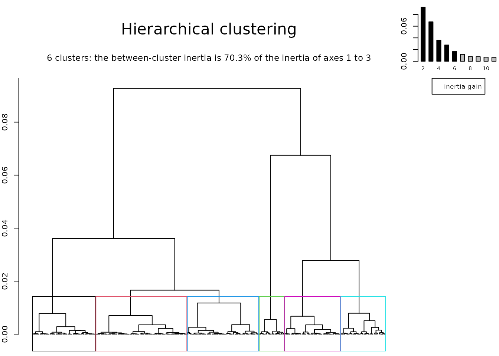
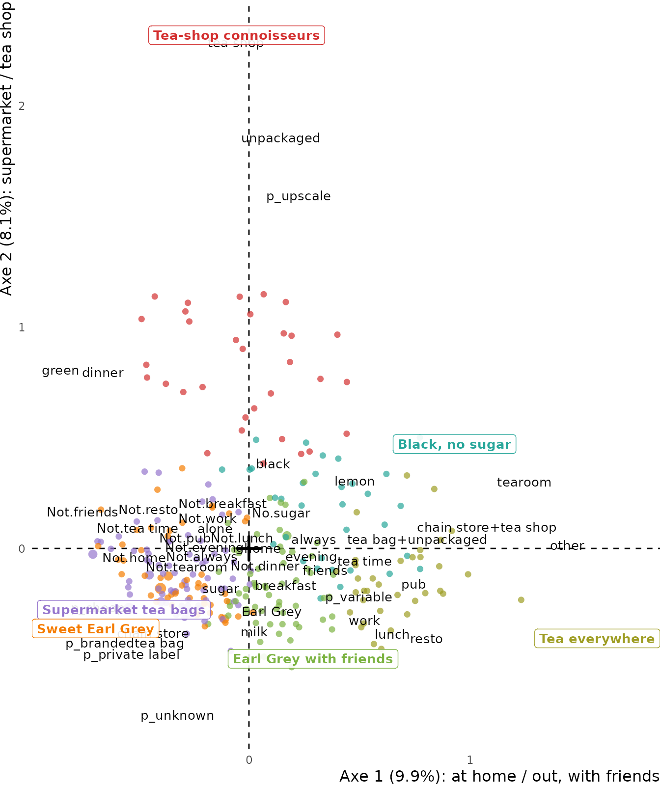

# Introduction to ggfacto: PCA, CA and MCA, close to the data

*Ce guide existe aussi en français : [Introduction à
ggfacto](https://bricenocenti.github.io/ggfacto/articles/ggfacto-fr.html).*

`ggfacto` draws the geometric data analyses of `FactoMineR` so that they
can be read **without losing sight of the data**. Hover over a point of
the interactive graph, and it shows the crosstables it comes from, each
percentage coloured by its deviation from the mean: blue where a
category is over-represented, red where it is under-represented. A
category at the edge of the cloud then reads as the sum of its
deviations, which is the best guard against over-interpreting the
geometry.

The three methods share one workflow:

1.  the analysis, with the data frame first, as in
    [`tabxplor::tab()`](https://bricenocenti.github.io/tabxplor/reference/tab.html);
2.  [`interpret()`](https://bricenocenti.github.io/ggfacto/reference/interpret.md),
    the table of the axes, with the eigenvalues underneath;
3.  [`ggfacto()`](https://bricenocenti.github.io/ggfacto/reference/ggfacto.md),
    the graph, made interactive by `interactive = TRUE`;
4.  the clusters, added to the data frame with `mutate()` and described
    by
    [`clust_tab()`](https://bricenocenti.github.io/ggfacto/reference/clust_tab.md).

One option decides how every table prints, `tabxplor`’s and `ggfacto`’s
alike: with `options(tabxplor.print = "html")`, they print as html
tables in RStudio, Positron or a document.

## Principal component analysis: means

A PCA summarises numeric variables. Here, the cars of `mtcars` are
described by six active measurements, and the number of cylinders is a
supplementary variable.

``` r

cars <- mtcars |> mutate(cyl = factor(cyl))

pca <- principal_component_analysis(cars, c(mpg, disp, hp, drat, wt, qsec))
interpret(pca)
```

[TABLE]

|       | Variance   |            |        |
|-------|------------|------------|--------|
| Axe   | eigenvalue | % variance | cumul. |
|       | \<var\>    | \<col%\>   |        |
| Axe 1 | 4.187      | 69.8%      | 69.8%  |
| Axe 2 | 1.148      | 19.1%      | 88.9%  |
| Axe 3 | 0.333      | 5.6%       | 94.5%  |
| Axe 4 | 0.154      | 2.6%       | 97.1%  |
| Axe 5 | 0.125      | 2.1%       | 99.1%  |
| Axe 6 | 0.052      | 0.9%       | 100%   |
| Total | 6.000      | 100%       |        |

The table opens on the variables as they were **before** the analysis:
mean, standard deviation and **coefficient of variation** (`sd/mean`,
the standard deviation as a percentage of the mean, which can be
compared across variables measured in different units). Then comes each
axis: the coordinate of each variable (its correlation with the axis,
coloured), its contribution and its quality of representation (cos2).
The first axis, 70 % of the variance, sets displacement, horsepower and
weight against fuel economy (`mpg`): a size effect. The second singles
out the cars that are slow off the mark (`qsec`).

``` r

ggfacto(pca, cars, sup_vars = cyl, interactive = TRUE)
```

The biplot draws the cars (in grey), the active variables (the arrows),
and the supplementary categories at the centre of gravity of their cars.
**Hover**: an arrow gives its variable’s mean and coefficient of
variation; a supplementary category gives the mean of every active
variable within it, coloured by its deviation from the overall mean; a
car gives its own values. `ggfacto(pca, profiles = FALSE)` draws the
correlation circle alone.

## Correspondence analysis: a crosstable

A CA is the analysis of **one crosstable**, so it is computed on the
table itself. Here, religion is crossed with party identification in the
US General Social Survey sample of
[`forcats::gss_cat`](https://forcats.tidyverse.org/reference/gss_cat.html),
non-responses left out.

``` r

gss <- forcats::gss_cat |>
  filter(!relig %in% c("No answer", "Don't know", "Not applicable"),
         !partyid %in% c("No answer", "Don't know"))

tab(gss, relig, partyid, pct = "row", color = "contrib")
```

[TABLE]

With `color = "contrib"`, a cell is coloured by its **contribution to
the table’s variance**, which is what weighs in the analysis: blue when
it is over-represented, red when under-represented.

``` r

ca <- correspondence_analysis(tab(gss, relig, partyid))
interpret(ca)
```

[TABLE]

| Axe   | eigenvalue | % variance | cumul. |
|-------|------------|------------|--------|
|       | \<var\>    | \<col%\>   |        |
| Axe 1 | 0.049      | 76.2%      | 76.2%  |
| Axe 2 | 0.007      | 10.9%      | 87.1%  |
| Axe 3 | 0.005      | 7.5%       | 94.6%  |
| Axe 4 | 0.002      | 2.7%       | 97.3%  |
| Axe 5 | 0.001      | 2.0%       | 99.4%  |
| Axe 6 | 0          | 0.5%       | 99.9%  |
| Axe 7 | 0          | 0.1%       | 100%   |
| Total | 0.064      | 100%       |        |

On each axis,
[`interpret()`](https://bricenocenti.github.io/ggfacto/reference/interpret.md)
keeps only the categories that contribute more than average, facing each
other by the sign of their coordinate. The first axis, 76 % of the
variance, opposes Republican Protestants to the non-religious, who lean
towards independents and Democrats; the second sets Jewish respondents
and strong Democrats apart from Catholics. Once interpreted, the axes
are named, and the names are printed on the graphs and in the tables.

``` r

ca <- name_axes(ca, "Republican Protestants / no religion",
                    "Catholics / Jewish Democrats")
ggfacto(ca, interactive = TRUE)
```

Hover over a category to see its **profile**: its row of the crosstable,
each percentage coloured by its deviation from the mean. The CA shows
the **structure** of the table’s deviations, and says nothing of their
**size**: that is what the coloured table beside it is for.

## Multiple correspondence analysis: response patterns and the Burt table

An MCA analyses several questions at once. The `tea` survey of
`FactoMineR` asked 300 people 18 active questions about how they drink
tea.

``` r

data(tea, package = "FactoMineR")

mca <- multiple_correspondence_analysis(tea, 1:18)
interpret(mca, axes = 1:2)
```

[TABLE]

[TABLE]

In an MCA the raw rates of variance are low by construction, so the
number of axes to interpret is chosen on **Benzécri’s modified rates**,
in the eigenvalue table: 83 % for the first two axes here. The first
axis opposes tea drunk only at home to tea drunk out, with friends — in
tearooms, restaurants and pubs; the second, supermarket tea bags to
loose tea from specialist shops.

``` r

mca <- name_axes(mca, "at home / out, with friends",
                      "supermarket / tea shop")
ggfacto(mca, tea, sup_vars = c(sex, SPC), interactive = TRUE)
```

The data frame is passed again, second, for the supplementary variables
(in italics). Hover, and two things can be read:

- the **grey points** are the **response patterns**: the people who gave
  exactly the same answers, sized by their number. Each one lists its
  answers;
- each **category** shows its crosstables with every other active
  question. Together they form the **Burt table** the MCA is computed
  from, its deviations from the mean coloured. The data is back in view,
  without crossing the 18 questions two by two.

### Clustering

Hierarchical clustering groups together the individuals closest to one
another on the first axes. Without `nb_clust`, it draws the tree and
cuts it where the gain in between-cluster variance drops.

``` r

hierarchical_clust(mca, ncp = 3)
```



The clusters are added to the data frame with `mutate()`, named in the
order of your choice (`"name" = number`): the tree is not built again.

``` r

tea <- tea |>
  mutate(clusters = hierarchical_clust(mca, ncp = 3, names = c(
    "Supermarket tea bags"   = 1,
    "Sweet Earl Grey"        = 2,
    "Earl Grey with friends" = 4,
    "Black, no sugar"        = 5,
    "Tea-shop connoisseurs"  = 3,
    "Tea everywhere"         = 6
  )))

clust_tab(mca, tea, clusters)
```

[TABLE]

The table describes each cluster by the active variables, weighted as in
the analysis, with the deviations from the whole population coloured.
The graph places the clusters in the cloud, with their individuals in
their colour:

``` r

ggfacto(mca, tea, clust = clusters)
```



## Going further

- **Survey weights**: `wt =` in all three analyses. The weights carry
  through to the crosstables in the tooltips.
- **Specific MCA**: `excl =` leaves categories out of the analysis
  (missing values, by default). **Subpopulation**: `filter =`, or
  [`filter()`](https://rdrr.io/r/stats/filter.html) in the pipe, then
  the whole data frame passed to
  [`ggfacto()`](https://bricenocenti.github.io/ggfacto/reference/ggfacto.md).
- **Graphs**: they are `ggplot` objects, which you can extend with `+`
  before
  [`ggi()`](https://bricenocenti.github.io/ggfacto/reference/ggi.md).
  [`ggsave2()`](https://bricenocenti.github.io/ggfacto/reference/ggsave2.md)
  saves them, and
  [`ggmca_3d()`](https://bricenocenti.github.io/ggfacto/reference/ggmca_3d.md)
  and
  [`ggpca_3d()`](https://bricenocenti.github.io/ggfacto/reference/ggpca_3d.md)
  draw them in three dimensions.
- The coordinates of the individuals are added to the data frame with
  `mutate(axis1 = axis_coord(mca, 1))`, just like the clusters.

The
[reference](https://bricenocenti.github.io/ggfacto/reference/index.html)
documents every function.
